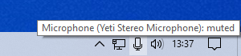

# Microphone Mute Indicator

A tiny program for showing the microphone mute status in the Windows taskbar
notification area.

## Screenshots





## Installation

Download the latest executable from the
[releases page](https://github.com/DvdGiessen/microphone-mute-indicator/releases),
and run it.

To run automatically at startup, you can put it in your Startup directory
(`shell:Startup` or `%APPDATA%\Microsoft\Windows\Start Menu\Programs\Startup`).

To use any of the advanced options described below you can save the executable
somewhere else, make a shortcut to it in the Startup directory, and add your
desired options at the end of the "Target" in the shortcut properties.

## Usage

The program shows the status of the current default communication audio capture
device in the system tray on the Windows task bar.

- The notification icon indicates whether the device is currently muted.
- Hover the notification icon to display the name and volume of the device.
- Left-click the notification icon to mute or unmute the device.
- Right-click the notification icon to access some additional options:
  - Selecting a different capture device
  - Setting the recording volume to its maximum
  - Opening the Recording tab of the Sound Control Panel
  - Exiting the program

## Advanced usage

A number of command line options are supported to configure the program or
perform certain actions:

- `--config-force-keep-volume-at-max`:

  Configuration option. Forcefully keeps the recording volume at 100%. This
  replaces the "Set recording volume to 100%" menu option:

  

- `--config-icon-theme <auto|normal|inverted>`

  Configuration option. Overrides the automatic light/dark theme detection. Note
  this can also be used to automatically invert the colors of a custom icon.

- `--config-icon-active <path>`

  Configuration option. Sets a custom icon for when the microphone is active.

- `--config-icon-muted <path>`

  Configuration option. Sets a custom icon for when the microphone is muted.

- `--action-mute`

  Immediate action. Mutes the microphone.

- `--action-unmute`

  Immediate action. Unmutes the microphone.

- `--action-toggle-mute`

  Immediate action. Toggles the microphone mute.

- `--action-set-volume-to-max`

  Immediate action. Sets the recording volume to 100%.

- `--action-exit`

  Exit immediately after performing other actions.

## Building from source code

The build command to create a nice small executable:

```sh
cargo +nightly build -Z build-std=std,panic_abort -Z build-std-features=panic_immediate_abort --target x86_64-pc-windows-msvc --release
```

## Issues

If you have any issues with Microphone Mute Indicator, first check the issue
tracker to see whether it was already reported by someone else. If not, go ahead
and create a new issue. Try to include as much information (version of the
program, version of Windows, steps to reproduce) as possible.

## License

Microphone Mute Indicator is freely distributable under the terms of the MIT
license.

## Alternatives

- [MicStatus](https://github.com/alandau/MicStatus) by Alex Landau
